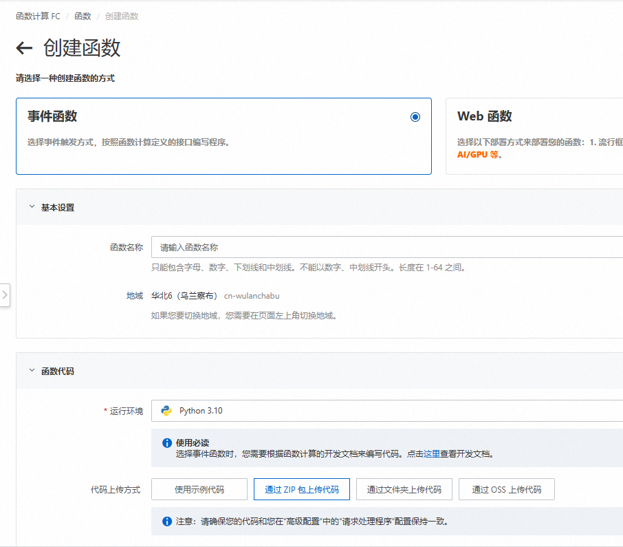
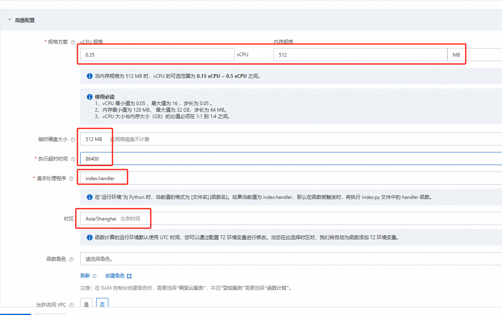

# 获取当当图书数据

## 0.免责声明
本Repo中的所有代码只代表一种技术方案的尝试，请勿擅自将其应用于**商业场景**中，否则请**自行承担违规及法律风险**。

## 1.安装依赖

```shell
pip install -r requirements.txt
```

## 2.参数调整

1. 调整`main.py`文件中数据库连接部分的配置内容，见db_config
2. 调整需要遍历的ID范围
```python
for product_id in range(29503785, 31502099):
```

## 3.运行脚本
```shell
python main.py
```


## 4.注意
同1个IP一定时间内能获取数据量受限，当前脚本为单线程，若想进行多线程改造，需考虑使用不同IP

### 4.1.可能的一种方案
利用阿里云的函数计算：https://www.aliyun.com/product/fc
进行多个函数实例的部署，不同函数实例的IP不相同，因此可达成并发多线程获取数据的目的

创建函数时，选择事件函数，运行环境选择python3.10，代码上传方式采用ZIP包


高级配置中采用如图配置即可，


当前代码中index.py中已包含函数入口

如何对python代码进行ZIP打包：
```shell
# 进入当前代码目录
cd test

# 将依赖安装在当前目录
pip install -r requirements.txt -t .

# 选中当前文件夹中所有内容，打包成ZIP包
```
